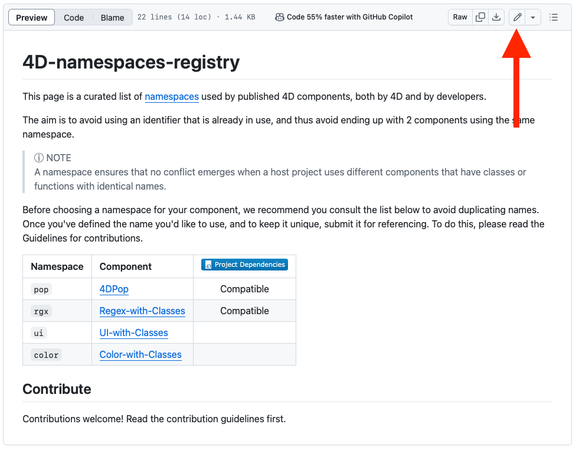
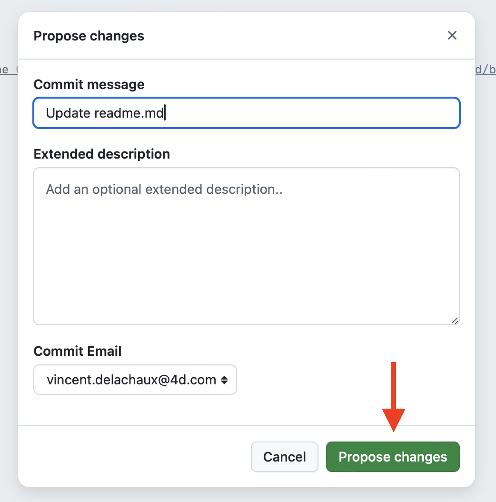
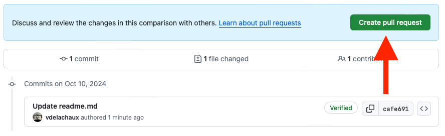

# Contribution Guidelines

Please note that this project is released with a
[Contributor Code of Conduct](code-of-conduct.md). By participating in this
project you agree to abide by its terms.

---

Ensure your pull request adheres to the following guidelines:

- All links must be relevant, tested and well described.
- Use the following format: `[List Name](link)`.
- Make an individual pull request for each suggestion.
- Improvements to the existing are welcome.
- The pull request and commit should have a useful title.

Thank you for your suggestions!


## Adding your namespace to the list (Pull Request)

**If you'd like to be added to this list, this is how you do it.**

> ⚠️ You'll need a [GitHub account](https://github.com/join)!

<hr>
① Access the 4D namespace registry GitHub readme page: https://github.com/4d/4D-namespaces-registry/blob/main/README.md

<hr>
② Click on the edit icon. 



<hr>
③ You can start editing the text of the file in the in-browser editor. Make sure you follow guidelines above. You can use [GitHub Flavored Markdown](https://help.github.com/articles/github-flavored-markdown/). 


Add a line to the table with your namespace and the link to the component repository. 

> ⚠️ Don't forget to indicate whether your component is compatible with the [Project dependencies manager](https://developer.4d.com/docs/Project/components#monitoring-project-dependencies).

Example:

```
| `myComp` | [my Component](https://github.com/organistaion/my-component) | Compatible
```

<hr>
④ When you've finished, click on the green “Commit changes…” button in the top right-hand corner. You can add a comment, then validate with the “Propose changes” button.



<hr>
⑤ Finally, create the [pull request] (https://help.github.com/articles/using-pull-requests/) by clicking on the green button.



<hr>
👏 Well done, we'll process your request

## If we ask you to update your Pull Request

It is often difficult to ensure that a Pull Request complies with the above standards. If the maintainers notice something we'd like to change, we'll ask you to edit your Pull Request before merging it. There's no need to open a new Pull Request, just edit the existing one. If you're not sure how to do this, [here's a guide](https://github.com/RichardLitt/knowledge/blob/master/github/amending-a-commit-guide.md) to the different ways you can update your Pull Request so we can merge it.
